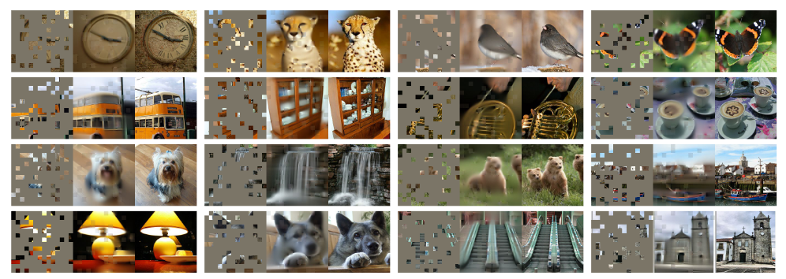
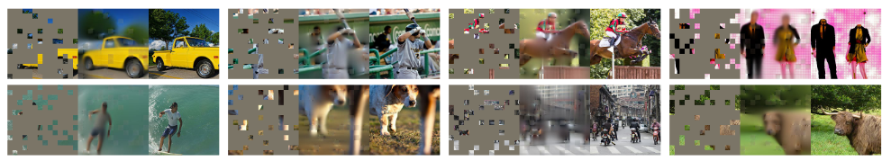
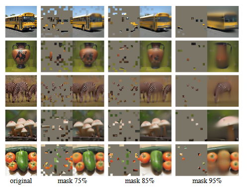
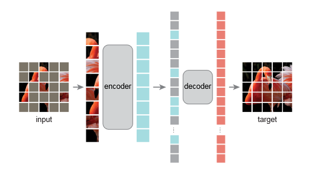

# 思路整理

- transformer：纯基于注意力机制的编码器和解码器
- BERT：基于Transformer的Encoder结构，将模型应用拓展到了更广泛的NLP任务中。BERT采用一种类似完形填空的**自监督学习机制**，即通过Mask掉输入句子中的一部分词，然后预测这些被遮盖的词来进行训练，从而获取对文本的特征抽取的能力。由于这种方法无需人工标注数据，BERT可以在大规模未标注语料上学习有效的文本表示。BERT极大地扩展了Transformer的应用，可以在大规模的、没有标号的数据上训练出非常好的模型。
- ViT：将transformer用到了CV领域。ViT证明了训练数据足够大的时候，transformer架构在CV领域的精度可以超越CNN。
- MAE：BERT的CV版本。MAE基于ViT这篇文章，将整个训练扩展到了没有标好的数据上面。

# 摘要

摘要开篇就介绍Masked Autoencoders (MAE) 是一种适用于**计算机视觉领域的**、可扩展的**自监督学习方法**。也就是说，它不需要大量的人工标注数据，依靠自己构造任务（如重建图像）来学习有效的特征表示。         
MAE 方法的思路非常直接：随机遮盖输入图像的一部分 patch（图像块），然后训练模型去重建被遮盖的像素。这类似于 NLP 中 BERT 的 masked language modeling。             

有两个关键：
1. 非对称的编码器-解码器结构：MAE 采用了非对称的结构设计
- Encoder（编码器）：只处理未被遮盖的图像块（可见部分），从而减小计算成本。
- Decoder（解码器）：结构轻量，利用编码器的输出以及 mask token 来重建原始图像。
> 好处：加快训练速度，节省计算资源，后面会详细介绍。
2. 高比例遮盖：遮盖比例很高（比如 75%）时，仍然能有效训练模型，并且这能使得模型学习到更强的全局图像理解能力。

实验表现：作者用 MAE 预训练后，对 ViT-Huge 模型在 ImageNet-1K 数据上进行微调（fine-tuning），达到了 87.8% 的 SOTA 精度，超过了当时其他仅用 ImageNet-1K 的方法。

迁移能力： MAE 在下游任务（如分类、检测、分割）中的迁移能力也很强，优于传统的有监督预训练方法。

# 1 Introduction

深度学习的发展依赖大量标注数据，模型规模迅速扩大，参数量动辄上亿，这使得获取充足的**有标签图像数据**成为模型提升的瓶颈，但是相比之下，自然语言处理（NLP）通过自监督预训练解决了类似问题（BERT和GPT），不再严重依赖标签数据。

在 NLP 中，自监督方法的核心思想是：**“遮盖一部分数据，训练模型去重建它”**。

受此启发，作者认为在CV领域自编码器也自然适用。作者认为：Masked Autoencoders 本质上是 Denoising Autoencoders 的一种形式，原因如下：
1. 在过去十年中，视觉领域主要由卷积神经网络（CNN）主导，但 CNN 结构限制了使用 masked autoencoding 的可能性，ViT 的出现消除了这一结构障碍，使得 MAE 方法得以在视觉领域应用。
2. 语言和视觉之间的一个根本性差异是：信息密度不同。
- 语言的信息密度高：语言具有高度的语义性和信息密度，因此训练模型预测句子中少数几个缺失的词，会迫使模型学会复杂的语言理解能力。
- 图像的冗余性强：相比语言，图像是自然信号，存在大量空间冗余。图像的每个区域之间往往非常相似，缺失一个 patch 时，模型可以只看周围的 patch 就猜出它是什么，不需要真正理解整体结构。这就使得 masked image modeling 的任务变得太简单了，模型可能只是在“抄周围”，而不是理解图像语义。
- 解决方法：为了解决这个问题，并引导模型学习有用的特征，作者提出一个简单但有效的方法：遮盖非常高比例的随机图像块。这样模型就不能光靠周围 patch 猜内容了，必须学会图像的全局语义表示。这种策略大幅度减少了冗余性，构造了一个更具挑战性的自监督任务，迫使模型超越低级图像特征，去进行整体理解。
> 重建任务的视觉效果，可以看Figure 2-4

    

**Figure 2**：             
每一组图像是一个三联图：
- 左边：遮盖后的输入图像（masked image）
- 中间：MAE 重建的图像
- 右边：原始图像

这张图是 MAE 有效性的“视觉证据”。它说明在高遮盖比下（80%），模型仍能产生高质量的图像重建，间接验证 MAE 学到的是具有全局感知能力的特征表示，而不是仅仅依赖局部冗余。

    

**Figure 3**：           
同figure2一样：
- 左边：遮盖后的输入图像（masked image）
- 中间：MAE 重建的图像
- 右边：原始图像

这组的图像不是来自 ImageNet，而是来自 COCO 验证集，但是 MAE 没有在 COCO 上训练，仅在 ImageNet 上训练。但是可以看出在遮盖依然很严重（80% missing），重建效果依旧合理。在 ImageNet 上训练的 MAE 模型也能泛化到不同分布的数据（COCO）上，说明模型不是在“记忆”图像，而是在“理解”图像的语义结构。

    

**Figure 4**：             
第一列：原始图像
第二列：75% 遮盖 → 与训练时一致
第三列：85% 遮盖
第四列：95% 遮盖 → 几乎看不到原图
> 固定一个 MAE 模型，然后输入遮挡程度越来越高的图像，看它还能不能合理地重建

图像重建结果是由训练时使用 75% 遮盖率的模型完成的，即便重建出的图像与原图不完全一致，在语义上仍是合理的（plausible），这说明 MAE 学到的是一种可泛化的语义建模能力，并且 MAE 不依赖于特定的遮盖比例也不依赖于记住具体图像细节，而是通过遮盖任务学会了对图像的通用理解。

    

1. MAE采用非对称的编码解码结果，mask符号在解码端加入，25%可见的patch在编码端，那么在下游任务中，编码端是会看到全部patch的，而不是25%，这是不是一个预训练和微调的一个gap呢。

2. VIT其实也有做这个实验，我接的应该只是用了50%patch和l2损失，但是效果差很多，这是不是因为调参的原因，还是有其他原因。

1. 这个可能是个问题 2. 是因为mae解码器也用了transformer，而且vit最原始的训练超参数不行，估计作者没仔细调