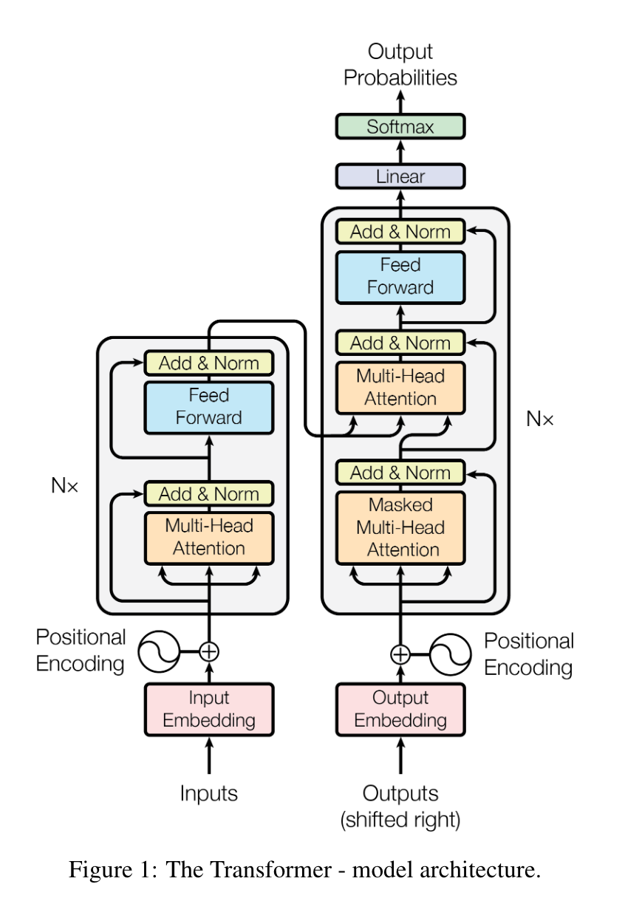

# 说明

这篇论文很特殊了，已经不需要有人再去说明它的重要性，所以这一次只讲解transformer这个模型，而不是像其他论文一样细致的讲解来龙去脉。

# 模型

Transformer 由两个主要部分组成：
- Encoder 编码器（图左侧，重复 N 次）
- Decoder 解码器（图右侧，重复 N 次）

输入从底部流入模型，经过多个层的处理，最终从顶部输出预测结果。

## 输入嵌入与位置编码

1. Input Embedding / Output Embedding
- 将离散的 token（单词或子词）通过查找表（embedding table）转换为连续的向量。
- 例如，“hello” → [0.1, 0.3, -0.2, ...]，维度通常是 d_model（比如 512 或 768）。
- Encoder 和 Decoder 各自有独立的嵌入层（但可以共享）。

2. Positional Encoding
- Transformer 本身不具备处理序列顺序的能力（不像 RNN 有递归结构）。
- 为了给模型注入“位置信息”，会将固定或可学习的位置编码加到嵌入向量上。
- 原始论文使用 固定的正余弦函数，定义如下：

$$
\text{PE}{(pos, 2i)} = \sin\left(\frac{pos}{10000^{2i/d{model}}}\right), \quad \text{PE}{(pos, 2i+1)} = \cos\left(\frac{pos}{10000^{2i/d{model}}}\right)
$$

- 最终：

$$
\text{Embedding + Positional Encoding} \to \text{输入 Encoder/Decoder}
$$

## 编码器（左侧）

Encoder 有 N 层，每层结构完全相同，包含两个子层：

3. Multi-Head Attention
- 每个输入 token 可以“注意”整个输入序列中的其他 token。
- 使用多组不同的线性变换（头），可以捕捉不同的语义子空间。

Attention 的基本公式：

$$
\text{Attention}(Q, K, V) = \text{softmax}\left(\frac{QK^T}{\sqrt{d_k}}\right)V
$$

- Q = Query，K = Key，V = Value，都是从输入向量线性变换得到。
- 多头注意力就是将上式重复 h 次（比如 8 次），然后拼接结果：

$$
\text{MultiHead}(Q, K, V) = \text{Concat}(\text{head}_1, …, \text{head}_h)W^O
$$

4. Add & Norm（残差连接 + LayerNorm）
- 将 Multi-Head Attention 的输出与原始输入相加（残差连接），然后 LayerNorm。
- 形式上：

$$
\text{Norm}(X + \text{SubLayer}(X))
$$

5. Feed Forward 网络（前馈全连接层）
- 结构：两层线性变换 + ReLU 或 GELU 激活：

$$
\text{FFN}(x) = \max(0, xW_1 + b_1)W_2 + b_2
$$

- 每个 token 独立处理，没有交互（类似于位置上的 MLP）。

6. 再次 Add & Norm
- 对 FFN 的输出和输入再做一次残差 + LayerNorm。

## 解码器（右侧）

Decoder 同样由 N 层组成：

7. Masked Multi-Head Attention
- Decoder 的第一个注意力层是自注意力，和 Encoder 类似。
- 不同之处：使用 Mask 阻止模型看到未来的信息。
- 训练时，模型不能看到当前位置之后的 token，保证自回归性质。

8. Add & Norm（同上）

9. Encoder-Decoder Attention
- Query 来自上一层 decoder 的输出；
- Key 和 Value 来自 Encoder 的输出。
- 这一步让 Decoder 能访问 Encoder 编码后的信息，建立输入输出之间的对应关系。

10. 再次 Add & Norm

11. Feed Forward & Add & Norm
- 同 Encoder 结构。

## 输出层

12. Linear + Softmax
- 将每个 decoder 输出向量映射到词汇表大小的 logits（线性层）；
- 然后用 softmax 得到概率分布，输出预测的下一个 token。

总结流程
	1.	输入序列 → Embedding + Positional Encoding → Encoder
	2.	输出序列（右移）→ Embedding + Positional Encoding → Decoder
	3.	Decoder 在每层接收 Encoder 的输出作为上下文。
	4.	Decoder 输出最后一个 token 的表示 → 线性映射 → Softmax → 预测下一个 token。

# Attention 模块如何计算

## 单头计算过程

给定三个输入向量：
A，B，C

输入矩阵：

$$
\textbf{X} = 
\begin{bmatrix}
A\\
B\\
C
\end{bmatrix} 
$$

线性变换矩阵（权重）：
Wq, Wk, Wv

分别映射得到：

$$
\textbf{Q} = 
\begin{bmatrix}
Q^A\\
Q^B\\
Q^C
\end{bmatrix} 
= \textbf{X} \cdot \textbf{W}_Q
$$

$$
\textbf{K} = 
\begin{bmatrix}
K^A \\
K^B \\
K^C
\end{bmatrix}
= \textbf{X} \cdot \textbf{W}_K
$$

$$
\textbf{V} = 
\begin{bmatrix}
V^A \\
V^B \\
V^C
\end{bmatrix}
= \textbf{X} \cdot \textbf{W}_V
$$

对 K 做转置：

$$
\textbf{K}^\top = 
\begin{bmatrix}
K^A & K^B & K^C
\end{bmatrix}
$$

计算 QK^T，得到注意力得分矩阵：

$$
\textbf{Q} \cdot \textbf{K}^\top =
\begin{bmatrix}
Q^A \cdot K^A & Q^A \cdot K^B & Q^A \cdot K^C \\
Q^B \cdot K^A & Q^B \cdot K^B & Q^B \cdot K^C \\
Q^C \cdot K^A & Q^C \cdot K^B & Q^C \cdot K^C
\end{bmatrix}
$$

缩放：

$$
\text{Attention Scores (scaled)} = 
\frac{\textbf{Q} \cdot \textbf{K}^\top}{\sqrt{d_k}}
$$

softmax 归一化（行方向）：

$$
\text{Attention Weights} = \text{softmax} \left( \frac{\textbf{Q} \cdot \textbf{K}^\top}{\sqrt{d_k}} \right)
$$

最终输出：

$$
\text{Output} = \text{Attention Weights} \cdot \textbf{V}
$$

## 计算格式格式

### 1. 输入格式

假设输入序列有 $n$ 个 token（例如 A、B、C），每个 token 是长度为 $d_{\text{model}}$ 的向量：

$$
\textbf{X} \in \mathbb{R}^{n \times d_{\text{model}}}
$$

其中：

- $n$ 是序列长度（即 A、B、C 的数量）；
- $d_{\text{model}}$ 是每个 token 的特征维度（即 len(A) = len(B) = len(C) = d_model）。

### 2. 权重矩阵维度

注意力的权重矩阵定义如下：

- 查询权重矩阵：     

$$
\mathbf{W}_Q\in\mathbb{R}^{d_{\mathrm{model}}\times d_k}
$$

- 键权重矩阵：       

$$
\mathbf{W}_K\in\mathbb{R}^{d_{\mathrm{model}}\times d_k}
$$

- 值权重矩阵：         

$$
\mathbf{W}_V\in\mathbb{R}^{d_{\mathrm{model}}\times d_v}
$$

> 通常： $d_k = d_v = d_{\text{model}} / h$ ，其中 $h$ 是多头数量（单头时就是 $d_k = d_v = d_{\text{model}}$ ）

### 3. 映射后得到的矩阵维度

- 查询矩阵：

$$
\textbf{Q} = \textbf{X} \cdot \textbf{W}_Q \in \mathbb{R}^{n \times d_k}
$$

- 键矩阵：

$$
\textbf{K} = \textbf{X} \cdot \textbf{W}_K \in \mathbb{R}^{n \times d_k}
$$

- 值矩阵：

$$
\textbf{V} = \textbf{X} \cdot \textbf{W}_V \in \mathbb{R}^{n \times d_v}
$$

### 4. 注意力得分与输出维度

- 键矩阵转置：

$$
\textbf{K}^\top \in \mathbb{R}^{d_k \times n}
$$

- 注意力得分矩阵：

$$
\textbf{Q} \cdot \textbf{K}^\top \in \mathbb{R}^{n \times n}
$$

- softmax 后的注意力权重矩阵：

$$
\text{Attention Weights} \in \mathbb{R}^{n \times n}
$$

- 输出结果矩阵（经过注意力加权）：

$$
\text{Output} = \text{Attention Weights} \cdot \textbf{V} \in \mathbb{R}^{n \times d_v}
$$

### 总结注意点

- 输入序列中的每个 token 长度必须为 $d_{\text{model}}$
- 权重矩阵的输入维度必须匹配 $d_{\text{model}}$，输出维度决定注意力子空间 $d_k$ 和 $d_v$
- 输出的 shape 始终是：

$$
\boxed{\text{Output} \in \mathbb{R}^{n \times d_v}}
$$

## 举个例子

### 1. 输入表示（token embedding）

假设有三个输入 token：

$$
\begin{aligned}
A &= [1, 0, 1, 0] \\\\
B &= [0, 2, 0, 2] \\\\
C &= [1, 1, 1, 1]
\end{aligned}
$$

组合成输入矩阵 $X$：

$$
X = \begin{bmatrix}
1 & 0 & 1 & 0 \\\\
0 & 2 & 0 & 2 \\\\
1 & 1 & 1 & 1 \\
\end{bmatrix}
$$

### 2. 权重矩阵（注意力的可训练参数）

用于计算 Q、K、V 的线性变换：

- Query 权重矩阵 $W^Q$:

$$
W^Q = \begin{bmatrix}
1 & 0 & 1\\\\
1 & 0 & 0\\\\
0 & 0 & 1\\\\
0 & 1 & 1\\
\end{bmatrix}
$$

- Key 权重矩阵 $W^K$:

$$
W^K = \begin{bmatrix}
0 & 0 & 1 \\\\
1 & 1 & 0 \\\\
0 & 1 & 0\\\\
1 & 1 & 0 \\
\end{bmatrix}
$$

- Value 权重矩阵 $W^V$:

$$
W^V = \begin{bmatrix}
0 & 2 & 0 \\\\
0 & 3 & 0 \\\\
1 & 0 & 3 \\\\
1 & 1 & 0 \\
\end{bmatrix}
$$

### 3. 计算 Q, K, V

$$Q=X\cdot W^Q,\quad K=X\cdot W^K,\quad V=X\cdot W^V$$

#### 计算 Q:

$$
\begin{aligned}
Q = X \cdot W^Q =
\begin{bmatrix}
1 & 0 & 1 & 0 \\\\
0 & 2 & 0 & 2 \\\\
1 & 1 & 1 & 1 \\
\end{bmatrix}
\cdot
\begin{bmatrix}
1 & 0 & 1\\\\
1 & 0 & 0\\\\
0 & 0 & 1\\\\
0 & 1 & 1\\
\end{bmatrix}
&=
\begin{bmatrix}
1 & 0 & 2 \\\\
2 & 2 & 2 \\\\
2 & 1 & 3 \\
\end{bmatrix}
\end{aligned}
$$

#### 计算 K:

$$
\begin{aligned}
K = X \cdot W^K =
\begin{bmatrix}
1 & 0 & 1 & 0 \\\\
0 & 2 & 0 & 2 \\\\
1 & 1 & 1 & 1 \\
\end{bmatrix}
\cdot
\begin{bmatrix}
0 & 0 & 1 \\\\
1 & 1 & 0 \\\\
0 & 1 & 0\\\\
1 & 1 & 0 \\
\end{bmatrix}
&=
\begin{bmatrix}
0 & 1 & 1 \\\\
4 & 4 & 0 \\\\
2 & 3 & 1 \\
\end{bmatrix}
\end{aligned}
$$

#### 计算 V:

$$
\begin{aligned}
V = X \cdot W^V =
\begin{bmatrix}
1 & 0 & 1 & 0 \\\\
0 & 2 & 0 & 2 \\\\
1 & 1 & 1 & 1 \\
\end{bmatrix}
\cdot
\begin{bmatrix}
0 & 2 & 0 \\\\
0 & 3 & 0 \\\\
1 & 0 & 3 \\\\
1 & 1 & 0 \\
\end{bmatrix}
&=
\begin{bmatrix}
1 & 2 & 3 \\\\
2 & 8 & 0 \\\\
2 & 6 & 3 \\
\end{bmatrix}
\end{aligned}
$$

### 4. 计算注意力分数 $QK^T$

注意： $d_k = 3$ ，因此缩放因子为 $\sqrt{3} \approx 1.732$

先计算 $QK^T$：

$$
\begin{aligned}
QK^T = \begin{bmatrix}
2 & 0 \\\\
0 & 4 \\\\
2 & 2 \\
\end{bmatrix}
\cdot
\begin{bmatrix}
0 & 4 & 2 \\\\
2 & 0 & 2 \\
\end{bmatrix}
&=
\begin{bmatrix}
2 & 4 & 4 \\\\
4 & 16 & 12 \\\\
4 & 12 & 10 \\
\end{bmatrix}
\end{aligned}
$$

然后缩放：

$$\mathrm{Score}=\frac{QK^{T}}{\sqrt{3}}\approx
\begin{bmatrix}
1.1547 & 2.3094 & 2.3094 \\
 \\
2.3094 & 9.2376 & 6.9282 \\
 \\
2.3094 & 6.9282 & 5.7735
\end{bmatrix}$$

### 5. Softmax & 输出

对上面每一行做 softmax，得到注意力分布：

$$\text{AttentionWeight}_{i,j}=\frac{e^{\mathrm{Score}_{i,j}}}{\sum_ke^{\mathrm{Score}_{i,k}}}$$

得到注意力矩阵 $A$，再计算最终输出：

$$\mathrm{Output}=A\cdot V$$

最后的计算结果可以看Code下Attention.py代码

## 多头计算过程

给定三个输入向量：
A，B，C

输入矩阵：

$$
\textbf{X} =
\begin{bmatrix}
A\
B\
C
\end{bmatrix}
$$

对于每一个头（例如共 $h$ 个头），我们分别定义一组权重矩阵：

$$
W_Q^{(i)},\quad W_K^{(i)},\quad W_V^{(i)} \quad \text{for } i = 1, 2, …, h
$$

第 $i$ 个头的计算

1.	线性映射：

$$
\textbf{Q}^{(i)} = \textbf{X} \cdot \textbf{W}_Q^{(i)}, \quad
\textbf{K}^{(i)} = \textbf{X} \cdot \textbf{W}_K^{(i)}, \quad
\textbf{V}^{(i)} = \textbf{X} \cdot \textbf{W}_V^{(i)}
$$

2.	计算注意力得分矩阵：

$$
\text{Scores}^{(i)} = \frac{\textbf{Q}^{(i)} \cdot \left(\textbf{K}^{(i)}\right)^\top}{\sqrt{d_k}}
$$

3.	归一化注意力权重（Softmax）：

$$
\text{Attention}^{(i)} = \text{softmax}\left(\text{Scores}^{(i)}\right)
$$

4.	计算该头的输出：

$$
\text{Head}^{(i)} = \text{Attention}^{(i)} \cdot \textbf{V}^{(i)}
$$

拼接多个头并线性变换

将所有头的输出拼接在一起：

$$
\text{MultiHead} = \text{Concat} \left( \text{Head}^{(1)}, \text{Head}^{(2)}, …, \text{Head}^{(h)} \right)
$$

使用一个最终的线性变换矩阵 $W_O$：

$$
\text{Output} = \text{MultiHead} \cdot W_O
$$

## 补充

在单头自注意力机制中，通常不会使用最终的线性变换矩阵 $W_O$，即输出直接由注意力权重加权后的值给出：

$$
\text{Output} = \text{Attention Weights} \cdot \textbf{V}
$$

这种情况下，$W_O$ 并不是必要的。

**为什么多头注意力机制需要 $W_O$？**

对于多头注意力机制，不同头的输出会进行拼接：

$$
\text{MultiHead} = \text{Concat} \left( \text{Head}^{(1)}, \text{Head}^{(2)}, …, \text{Head}^{(h)} \right)
$$

拼接后的维度通常为 $h \cdot d_v$，为了将其映射回模型的原始维度 $d_{\text{model}}$，需要使用一个线性变换矩阵 $W_O \in \mathbb{R}^{(h \cdot d_v) \times d_{\text{model}}}$：

$$
\text{Output} = \text{MultiHead} \cdot W_O
$$

> 虽然单头注意力理论上也可以引入 $W_O$ 来提升表达能力或保持接口一致性，但在标准实现或论文中一般不会这么做。

## 多头注意力机制计算格式

### 1. 输入格式

假设输入序列有 $n$ 个 token（例如 A、B、C），每个 token 是长度为 $d_{\text{model}}$ 的向量：

$$
\textbf{X} \in \mathbb{R}^{n \times d_{\text{model}}}
$$

其中：
- $n$ 是序列长度；
- $d_{\text{model}}$ 是每个 token 的特征维度。

### 2. 权重矩阵维度（每个头）

对于每一个头 $i$，定义一组独立的线性投影矩阵：
- 查询权重矩阵：

$$
\mathbf{W}Q^{(i)} \in \mathbb{R}^{d{\text{model}} \times d_k}
$$
- 键权重矩阵：

$$
\mathbf{W}K^{(i)} \in \mathbb{R}^{d{\text{model}} \times d_k}
$$
- 值权重矩阵：

$$
\mathbf{W}V^{(i)} \in \mathbb{R}^{d{\text{model}} \times d_v}
$$

通常： $d_k = d_v = d_{\text{model}} / h$ ，其中 $h$ 是注意力头的数量。

### 3. 每个头的计算过程与维度

对于第 $i$ 个头：
- 查询矩阵：

$$
\textbf{Q}^{(i)} = \textbf{X} \cdot \mathbf{W}_Q^{(i)} \in \mathbb{R}^{n \times d_k}
$$
- 键矩阵：

$$
\textbf{K}^{(i)} = \textbf{X} \cdot \mathbf{W}_K^{(i)} \in \mathbb{R}^{n \times d_k}
$$
- 值矩阵：

$$
\textbf{V}^{(i)} = \textbf{X} \cdot \mathbf{W}_V^{(i)} \in \mathbb{R}^{n \times d_v}
$$
- 注意力得分矩阵：

$$
\textbf{Q}^{(i)} \cdot \left(\textbf{K}^{(i)}\right)^\top \in \mathbb{R}^{n \times n}
$$
- softmax 后的注意力权重矩阵：

$$
\text{Attention}^{(i)} \in \mathbb{R}^{n \times n}
$$
- 每个头的输出：

$$
\text{Head}^{(i)} = \text{Attention}^{(i)} \cdot \textbf{V}^{(i)} \in \mathbb{R}^{n \times d_v}
$$

### 4. 拼接多个头并进行线性变换

将所有 $h$ 个头的输出拼接在最后一维：

$$
\text{MultiHead} = \text{Concat}(\text{Head}^{(1)}, \dots, \text{Head}^{(h)}) \in \mathbb{R}^{n \times (h \cdot d_v)}
$$

使用一个线性变换矩阵 $W_O$ 将拼接后的结果映射回 $d_{\text{model}}$ 维空间：

$$
\mathbf{W}_O \in \mathbb{R}^{(h \cdot d_v) \times d{\text{model}}}
$$

最终输出为：

$$
\text{Output} = \text{MultiHead} \cdot \mathbf{W}_O \in \mathbb{R}^{n \times d{\text{model}}}
$$

### 总结注意点

- 每个头的输出维度是 $n \times d_v$，拼接后为 $n \times (h \cdot d_v)$；
- 输出经过 $W_O$ 线性变换后维度回到 $n \times d_{\text{model}}$；
- 多头注意力机制的输出维度为：

$$
\boxed{\text{Output} \in \mathbb{R}^{n \times d_{\text{model}}}}
$$
