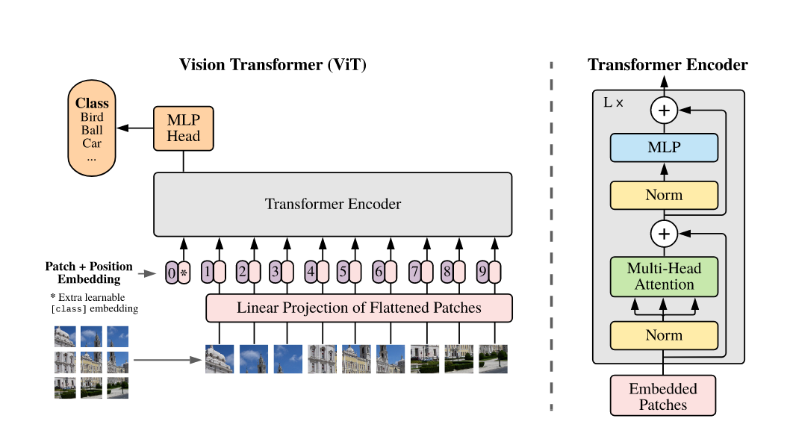
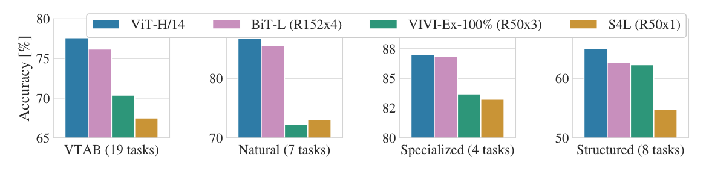
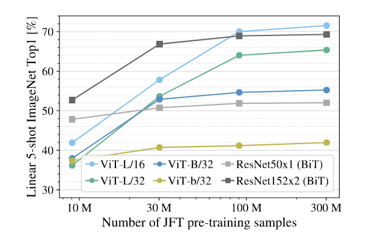
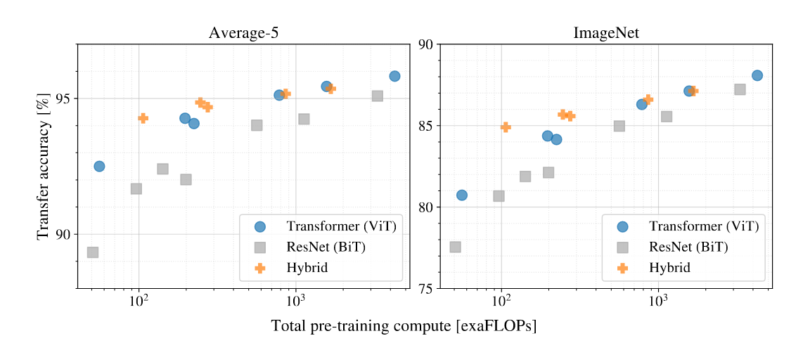
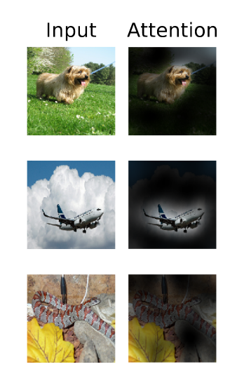
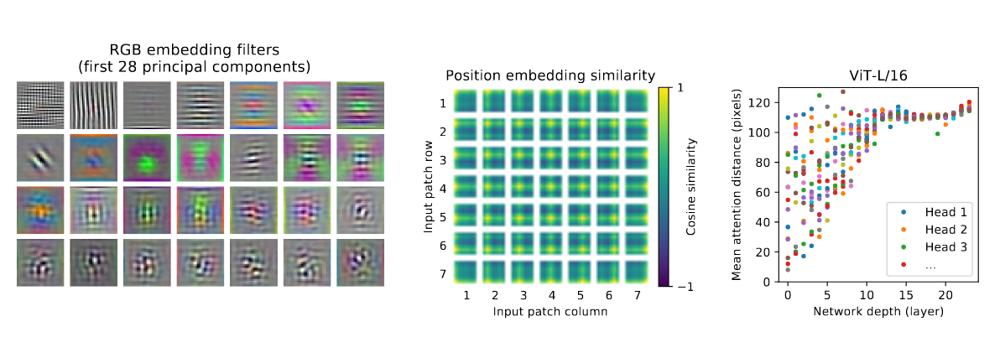

# 背景    

1. 在计算机视觉领域：

- 在ViT出现之前，卷积神经网络（CNN）长期以来一直是计算机视觉领域的主导方法。  
  像AlexNet、VGG、ResNet等一系列模型在大型数据集（如ImageNet）上取得了巨大成功，推动了视觉任务（如图像分类、目标检测、图像分割等）的进步。

- CNN 之所以成功，很大程度上是因为其**局部感受野**、**权值共享**和**平移不变性**等设计，使得模型能有效提取局部特征（如边缘、纹理、形状等），同时又能保持计算效率。

- 当时研究人员普遍认为：视觉任务需要强烈的归纳偏置（inductive bias），比如局部相关性和平移等变性，因此CNN天然适合视觉。

> 局部感受野（Local Receptive Field）：在卷积神经网络（CNN）中，一个神经元不会感知整张输入图片，而只关注输入数据中的一个小区域，这个小区域就叫做局部感受野。每个卷积核（滤波器）扫描输入时，只处理一部分局部信息。                
权值共享（Weight Sharing）：在CNN中，同一个卷积核在整张图片上滑动并应用到不同位置，意味着不同位置用的是同一组参数（权值），这就叫做权值共享。                 
平移不变性（Translation Invariance）：当输入图像中的物体发生小幅度平移时，CNN提取到的特征仍然保持稳定，最终的识别结果不会大幅变化。                          
 归纳偏置（Inductive Bias）：归纳偏置是指模型在学习数据之前，人为引入的假设或限制，目的是帮助模型更高效、更快地学习任务。也可以理解为：在设计模型时，我们预设了某些世界的规律。（CNN的局部感受野、权值共享就是针对图像数据特性的归纳偏置。）                    

2. Transformer 在自然语言处理领域的发展：

- 与此同时，在自然语言处理（NLP）领域，Transformer架构（由Vaswani等人在2017年提出）因其出色的建模长距离依赖关系的能力，在诸如机器翻译、文本生成、问答系统等任务中迅速取代了传统的RNN、LSTM等序列模型，成为主流。

- Transformer 的成功启发了视觉领域的研究者们思考：**能否用Transformer代替CNN，直接处理图像任务？**

3. ViT 的突破：

- ViT由Google Research的团队提出（论文："An Image is Worth 16x16 Words"，2020年），首次成功地证明了**纯Transformer结构在图像分类任务上可以媲美甚至超越CNN**，特别是在超大规模数据集（如JFT-300M）预训练后。

- 核心做法：
  - 把输入图像切分成固定大小的小块（patches），每个小块展平成一个向量。
  - 将这些向量序列化后，送入标准的Transformer编码器进行处理。
  - 不引入CNN特有的归纳偏置，仅靠大数据和强大的建模能力学习视觉特征。

- ViT也遵循了类似BERT和CV领域CNN+ImageNet的“预训练+微调（fine-tuning）”范式：  
  在超大规模数据集上进行预训练，再在下游任务（如图像分类）上进行微调，取得了极佳效果。      

- ViT终结了卷积神经网络在CV领域的统治地位，同时打破了CV和NLP在模型上的壁垒，为多模态的很多后续工作也做了很多的启发。

# 摘要    

1. 在背景上：                
Transformer在NLP领域已经成为了标准（比如BERT、GPT都用Transformer），但在CV领域，Transformer的应用还比较少。            
计算机视觉领域当前主要还是依赖卷积神经网络（CNNs），如ResNet、EfficientNet等。    

2. 在使用上：           
目前在视觉任务中，注意力机制（Attention）通常是：与CNN结合使用（例如SE-Net，引入Squeeze-and-Excitation模块）、局部替代CNN某些部分（例如用Self-Attention代替卷积核，但整体仍是CNN结构）      
在已有的一些使用中，注意力机制一般是辅助CNN，而不是彻底取代CNN。           

3. 本文工作：
不需要依赖CNN结构，只要直接把图片切成小块（patches），然后把这些小块的序列送进纯Transformer模型，就能很好地完成图像分类任务。     
- pure Transformer：纯Transformer结构，没有CNN。      
- image patches：将一张图像切成小块（16×16像素的小块）。    

4. 效果：
当ViT在大量数据上预训练（比如用JFT-300M这种超大数据集），然后迁移到其他中小规模的数据集（如ImageNet、CIFAR-100、VTAB）进行微调时，ViT在这些任务上达到了非常优秀的效果，可以超过当前最先进的CNN模型（比如EfficientNet）。
而且，训练所需的计算资源还比CNN更少（这个只需要看看即可，对Google来说多少计算资源可能都算少）。 
> 这里凸显出了很重要的一点，无论是BERT还是ViT，当前这种模型的主流方向都是大规模数据集上预训练，然后迁移到较小的特定任务数据集上学习，进行微调。

# 1 引言      

1. 引言上来首先进行背景介绍：

- **Transformer模型在NLP中的成功**  
  - 自从**Vaswani et al., 2017**提出Transformer之后，Transformer成为了NLP领域的主流架构。
  - 典型做法是：**先在大规模语料上预训练**，再在小任务上**微调**（fine-tune）。
  - Transformer因为**计算效率高、可扩展性好**，使得可以训练拥有**上百亿参数**的大模型（如Brown et al. - GPT3:Language Models are Few-Shot Learners, 2020；Lepikhin et al., 2020 - GShard: Scaling Giant Models with Conditional Computation）。
  - **非常重要的一点是**：随着模型和数据规模不断增大，目前性能还没有饱和的迹象。

2. 转向计算机视觉（CV）领域的现状

- **计算机视觉（CV）领域仍以卷积神经网络（CNN）为主流**  
  - 像**LeCun et al., 1989**和**Krizhevsky et al., 2012**这样的经典工作确立了CNN在CV领域的统治地位。
  - **受到NLP成功启发**，有些工作开始尝试：
    - 将CNN与**self-attention机制结合**（如Wang et al., 2018；Carion et al., 2020）
    - 甚至**完全用self-attention取代卷积**（如Ramachandran et al., 2019；Wang et al., 2020a）
  - 但即便如此，这些方法目前还**没有在硬件上实现有效扩展**，并且在大规模视觉任务中，像**ResNet这种传统CNN架构仍然是主流**（Mahajan et al., 2018；Xie et al., 2020；Kolesnikov et al., 2020）。

> 说明一下“没有在硬件上实现有效扩展”是什么意思？     
像孤立自注意力或轴自注意力等实现起来较为复杂，没有专门的硬件为其加速，使其理论上较为高效，但是实际上冰美誉与其匹配的硬件，原因在于他们没有像GPT、ViT或者BERT一样直接用Transformer，而是要做很多中间工作导致模型实现起来很复杂。       

3. 本文提出的研究动机

- **想法**：既然Transformer在NLP领域扩展得这么好，那能不能**直接拿Transformer用在图像上**，而且尽可能**少做改动**（就是指不做针对视觉任务的改动，直接用）？
- **具体做法**：
  - 把图像**切成小块（patches）**
  - 将这些小块**线性嵌入（linear embedding）**成向量序列
  - 把它们喂给一个**标准的Transformer**（就像NLP里把单词序列喂给Transformer一样）
- **训练方式**：在图像分类任务上用**有监督学习**训练。

4. 效果：

- **如果只在像ImageNet这种中型数据集上训练**，而且**没有用很强的正则化**，这种Transformer模型的效果**比同规模的ResNet差几个百分点**。
- **原因**：
  - Transformer相比CNN，**缺少某些归纳偏置（inductive bias）**，比如：
    - **平移等变性**（translation equivariance）
    - **局部性**（locality）
  - 因此Transformer在数据量不足时**泛化能力差一些**。
- **如果用非常大的数据集（1400万到3亿张图）来训练**，情况就不同了：
  - 大数据量带来了**更强的归纳偏置学习能力**。
  - **Vision Transformer (ViT)** 取得了非常优秀的结果：
    - 在ImageNet-21k、JFT-300M预训练后，再在小数据集微调，效果极好。
    - 在多个图像识别任务上，**ViT可以达到或超过最先进水平**：
      - ImageNet上88.55%
      - ImageNet-Real上90.72%
      - CIFAR-100上94.55%
      - VTAB（19个任务合集）上77.63%

# 2 相关工作    

1. Transformer 的 NLP 成就和图像应用的挑战

- Transformer 在 NLP 中的成功：
   - 最早由 Vaswani et al., 2017 提出用于机器翻译。
   - 后来广泛应用于 NLP 各类任务，特别是在大规模预训练的框架下（如 BERT, GPT）。
   - 如 BERT 使用掩码语言模型（Devlin et al., 2019），GPT 使用自回归语言模型（Radford et al., 2018, 2019）进行预训练。
- 图像应用中的挑战：
   - 直接将 self-attention 应用到图像，意味着每个像素都要关注到其他像素，这在大图像上是不可扩展的（计算量为像素数的平方）。
   - 因此需要改进或近似方法，使 self-attention 能更高效地用于图像任务。

2. 已有的 self-attention 变体与优化

- 局部 self-attention 的尝试：
   - Parmar et al., 2018 仅在局部区域对每个像素进行 self-attention，降低计算复杂度。
   - 类似的还有 Hu et al., 2019；Ramachandran et al., 2019；Zhao et al., 2020，这些方法使用局部 multi-head attention来替代卷积操作。
- 稀疏 self-attention（Sparse Transformers）：
   - Child et al., 2019 提出了稀疏 Transformer，通过近似方式减少计算负担，使得 self-attention 能扩展到更大的图像。
- 轴向 attention / 分块 attention 的方法：
   - 如 Weissenborn et al., 2019；Ho et al., 2019，这些方法只在图像的某些维度或子块上进行 self-attention，以进一步降低计算量。
- 总结：
   - 上述方法都能在视觉任务上获得不错效果，但都需要复杂的工程实现才能在硬件上高效运行（引言中已说明）。

3. 与本论文最相关的工作

- Cordonnier et al., 2020 的模型：
   - 该模型从图像中提取 2×2 的小 patch，并对这些 patch 应用 full self-attention。
   - 和 ViT 类似，但只适用于低分辨率图像。
   - 本文相比之下，处理了中等分辨率图像，而且显示在大规模预训练后，Vanilla Transformer（未做复杂改动）性能可比甚至超越最先进的 CNN。

4. CNN 和 self-attention 的结合研究
- 研究趋势：将 self-attention 和 CNN 结合使用，包括：
   - 增强特征图（如 Bello et al., 2019）
   - 为目标检测添加 self-attention 模块（如 Hu et al., 2018）
   - 用于图像分类、目标发现、跨模态任务等（如 Carion et al., 2020；Wang et al., 2018；Sun et al., 2019；Wu et al., 2020；Chen et al., 2020c）

5. iGPT 模型——一种无监督 Transformer 图像模型
- iGPT（Chen et al., 2020a）：
   - 类似 GPT，但用于图像。
   - 将图像转为低分辨率并线性展开，然后在像素序列上用 Transformer 进行训练。
   - 使用无监督学习作为生成模型，最后用线性分类器进行分类，在 ImageNet 上达到 72% 准确率。

6. 大数据集预训练在图像任务中的重要性
- 越来越多的论文（Mahajan et al., 2018；Touvron et al., 2019；Xie et al., 2020）关注 在大规模图像数据集（如 ImageNet-21k 和 JFT-300M）上训练模型。
- 一些研究探讨了 CNN 在不同数据规模下的表现（如 Sun et al., 2017；Kolesnikov et al., 2020）。
- 本文工作：
   - 聚焦于 ViT 在大数据集上的表现。
   - 发现只要用足够的数据训练，即使是不加改动的 Transformer 也能在图像任务中取得优异成绩，挑战了“必须使用 CNN”的传统观念。

总结：

1.	直接用 Transformer 处理图像的问题与挑战（计算复杂度高）。
2.	已有各种简化或改进方法（局部 attention、稀疏 attention、轴向 attention 等）。
3.	与本文最相关的前作（Cordonnier et al., 2020）只处理低分辨率图像。
4.	CNN 与 self-attention 的结合趋势。
5.	iGPT 模型的创新：像 GPT 一样处理图像像素序列。
6.	强调大规模预训练的关键作用，为本文的 ViT 模型提供理论与实践支撑。

# 3 Method    

首先作者说明在模型设计时尽可能忠于原始的Transformer结构，他们没有对Transformer架构做太多修改，不像某些图像模型那样引入复杂的局部注意力、稀疏结构、额外模块等，他们用的是一个“标准的”Transformer架构，只是将输入从“词向量”变成了“图像patch的线性嵌入”。

这种设计的好处在于其“简洁性”，因为没有对结构做复杂修改，所以可以直接使用现有的高效NLP Transformer实现代码（如TensorFlow或PyTorch中的实现）。这些实现已经被广泛优化过，因此迁移到图像任务上几乎无需额外开发工作，具有很好的工程实用性和可扩展性。

## 3.1 VISION TRANSFORMER (VIT)    

    

Figure 1 是 ViT 的结构总览图，下面来详细了解一下 ViT 在使用 transformer 处理图像之前如何对图像进行预处理。

**1. 划分 Patch + 线性映射**

假设我们有一张 *H × W × C* 的图片，而后将图片划分为固定大小的 Patch ，每张 Patch 大小为 P^2^ ，所以 *H × W* 的图片会被分为：          

$$
N = \frac{H \times W}{P \times P}
$$

个小Patch，每个小Patch为 *P × P × C*，通过 **Linear Projection of Flattened Patches** 模块将每个小Patch展平为 *P^2^ * C* 大小的向量。

e.g: 
*H = 224, W = 224, C = 3, P = 16*

$$
N = \frac{224 \times 224}{16 \times 16} = 196\ \text{patch}
$$

$$
P^2 * C = {16 \times 16 \times 3} = 768
$$

讲一个 *224 * 224 * 3*的图片展为了一个 *196 * 768* 的矩阵。

> 这里可以这样理解，就相当于BERT的输入有196个Token，每个Token各有大小为768的 feature 向量。这样的目的还是为了尽可能不去改动模型，能更好的去使用已有的关于 Transformer 的各种硬件加速。      

**2. [CLS] Token + 位置编码**    

在所有 patch 向量的最前面插入一个额外的 learnable token，记作 [CLS]（classification token），该向量：
- 初始值是可学习的向量
- 经过 Transformer 后，ViT 使用这个 [CLS] 对应的输出向量来做整张图的分类决策   

> 这里也借鉴了 BERT 的做法    

Transformer 本身不理解序列中各元素的“位置”，所以要给每个 patch 向量加上位置编码：
$$
\text{Input Embedding} = \text{Patch Embedding} + \text{Positional Embedding}
$$
位置编码是可学习的，与 BERT 类似，也可以是正弦位置编码（不过ViT论文中用的是learnable）。

这里有一个点，Patch Embedding 和 Positional Embedding 是两个长度为768的向量，在输入的时候才会将两者相加起来输入到模型中去，两个向量各自都保留着，在反向传播的时候都会各自学习而后优化。
虽然它们在前向传播中相加成了一个向量，但它们在模型参数结构上依然是分开的、独立可优化的参数矩阵。

**3. 得到输入序列并送入 Transformer Encoder**    

最终我们得到了一个输入序列：
- 总长度是 N + 1，其中 N 是 patch 数（比如196），+1 是 [CLS] token
- 每个元素是一个 *P^2^ * C* -维向量（比如768维）

这个序列就可以送入标准的 Transformer Encoder 结构，进行全局的信息建模。

**注：** *输入之前的处理部分已经结束，这也是ViT最特殊的部分，接下来的部分与原始的 Transformer Encoder 中一致，接下来不会讲的特别详细。*

**4. LayerNorm**    

对每个 token 的向量做 Layer Normalization：
- 让不同维度的值分布更稳定；
- 有助于训练时梯度传播和收敛速度。

**5. Multi-Head Self-Attention**    

这是 Transformer 的核心计算模块，每个 token（包括 [CLS]）会和其他所有 token 做交互（注意力机制），捕捉全局信息。
- 每个 token 生成 Query、Key、Value 向量；
- 多个头（比如 12 个）分别计算注意力得分；
- 拼接所有注意力头的结果再通过线性层融合。

> ViT 正是依赖这个机制建立 patch 之间的全局关系，不像 CNN 只能局部感知。

**6. 残差连接（Residual Add）**

把输入直接加回 Multi-Head Attention 的输出：
$$
\text{Output} = \text{Input} + \text{AttentionOutput}
$$
这样可以防止梯度消失，也利于模型保留原始信息。

**7. 第二次 LayerNorm**

和前面一样，对 Attention 结果进行归一化。

**8. MLP**

每个 token 的向量都会通过一个小的全连接网络（常见是 2 层 MLP）：
- 通常会包含 ReLU 或 GELU 激活函数（Transformer Encoder 中是GELU）；
- 提供非线性建模能力；
- 这相当于“局部特征转换”，对每个位置独立处理（不像 attention 会跨位置交互）。

**9. 第二个残差连接** 

再把 Attention 输出加上 MLP 输出，完成这一层：
$$
\text{FinalOutput} = \text{AttentionOutput} + \text{MLPOutput}
$$

**10. 重复上述 4 - 9 步，堆叠 L 层**

**11.取出 [CLS] Token 用于分类**
- [CLS] 位置的向量经过 L 层处理后，包含了全图的全局特征信息；
- 这个向量送入一个 MLP 头（分类头），输出最终预测；

*模型讲解完后作者讲了一下关于ViT的Inductive Bias（归纳偏置）*，特别说明了**ViT 的归纳偏置比 CNN 弱得多**     

### Inductive Bias    

CNN 天生具备很多针对图像的归纳偏执：
1. 局部性    
2. 平移等变性     

等在模型的每一层都有体现，这种先验知识贯穿了整个模型始终。        
ViT 是纯 Transformer 架构，并没有这些特性，因此：
1. ViT 的 MLP 层是逐 token 处理的，只有“局部变换”作用；
2. ViT 的 self-attention 是“全局”的，没有使用 2D 空间结构；
3. ViT 只在开头将图像切成 patch，之后对 patch 的顺序几乎不管；
4. 位置编码在初始化时并不携带任何图像结构信息，位置关系、举例信息、场景信息等都是学习得来的，而不是像CNN本身就有的。    

因此在中小数据集上ViT不如CNN（后面实验部分有说明）。  

### Hybrid Architecture（混合架构）

作者此处的目的是：为了弥补 ViT 归纳偏置少的问题，引入 CNN 提前提取特征作为输入。

对于图片处理方式：把原始图像切 patch 后直接送进 Transformer，         
也可以先用这种方式： CNN 提取一层 feature map，再把 feature map 切 patch           
这样：
- 预处理过程仍利用了 CNN 的归纳偏置（例如 ResNet）；
- 后续仍使用 Transformer 编码器建模全局关系；
- 等于是结合了 CNN 的结构先验 + Transformer 的表达能力。

这种方法可以：
- 这样每个 patch 的输入来自更抽象、更结构化的特征；
- 可以缓解 ViT 在小数据集上学习困难的问题。

## 3.2 FINE-TUNING AND HIGHER RESOLUTION    

ViT 通常在大规模图像数据集上进行预训练（比如 ImageNet-21k 或 JFT-300M），获得通用的图像表示能力，然后再迁移到具体的小任务上微调（如图像分类、目标检测等），这就是典型的 “pre-train + fine-tune” 流程。

但是由于每个下游任务的类别数 K 通常不同，因此微调时会移除预训练时的分类头（即 MLP head），替换为一个新的全连接层，大小为：
$$
D \times K
$$
- D：Transformer 输出的维度（如768）
- K：当前任务的类别数
- 新的分类头初始化为零，并将在微调中重新训练。

微调阶段如果使用更高分辨率的图像输入（例如预训练用 224×224，微调时用 384×384）常常会提升性能（参考 Touvron et al., 2019；Kolesnikov et al., 2020），因为更高分辨率意味着图像被分成更多 patch，因此输入序列长度 N 会变长，模型能获取更多细节信息。    
但是原本训练好的 **1D位置编码（positional embedding）** 是针对预训练时固定数量的 patch 学到的，如果微调时使用更大的图像，patch 数 N 会变大，那么原始的位置编码长度就对不上了。       
解决方法是：对预训练好的位置编码进行二维插值（2D interpolation），使其适应新图像的 patch 数。
方法如下：
1.	把原来的 196 个 patch 位置编码（196 * D） reshape 成 14 * 14 * D
2.	用双线性插值（Bilinear Interpolation）放大到 24 * 24 * D
3.	reshape 成新的 576 * D 位置编码    

因为位置编码学到的是相对空间中的含义，右上、左上、中间等等，所以该方法不会改变模型学到的相对空间信息。

# 4 EXPERIMENTS

作者的实验对象有三种模型：
1.	ResNet：传统卷积神经网络（CNN）代表；
2.	Vision Transformer (ViT)；
3.	Hybrid：混合模型，把 CNN 和 Transformer 结合起来（如先用 CNN 提取特征，再用 Transformer 编码）。  

研究重点：不同模型的数据需求差异。
方法：使用不同大小的数据集（小、中、大）进行预训练，然后在多个标准任务上评估模型效果。
> 这是为了回答：ViT 是否比 ResNet 更依赖大数据？小数据下表现怎样？两个问题    

实验结果：
- ViT 不仅效果好，而且在计算成本（pre-training cost）方面也很有优势。
- 在大多数图像识别任务上（benchmark），ViT 达到最先进水平（state-of-the-art）。
- 上述结果是在更低预训练成本下获得的，说明 ViT 性能/成本比高。   

同时作者还做了一个额外实验：用自监督学习（self-supervised learning）训练 ViT，虽然只是小规模实验，但结果初步说明ViT 在自监督框架下也具有很大潜力，这为未来进一步研究提供了一个可能方向。

| Model     | Layers | Hidden size *D* | MLP size | Heads | Params |
|-----------|--------|------------------|----------|--------|--------|
| ViT-Base  | 12     | 768              | 3072     | 12     | 86M    |
| ViT-Large | 24     | 1024             | 4096     | 16     | 307M   |
| ViT-Huge  | 32     | 1280             | 5120     | 16     | 632M   |

**Table 1**: Details of Vision Transformer model variants.   

ViT 模型结构的不同配置：
| 字段           | 含义 |
|----------------|------|
| **Layers**     | Transformer 的层数（即堆叠的 Transformer 编码器数量） |
| **Hidden size D** | 每个 token 表示向量的维度，也叫 “Transformer embedding size” |
| **MLP size**   | 每个 Transformer Block 中 MLP 的隐藏层大小（通常是 Hidden size 的 4 倍） |
| **Heads**      | 多头注意力的头数 |
| **Params**     | 模型总参数量，越大表示模型容量越强，但也更难训练 |     

## 4.1 SETUP    
本段详细说明了作者的实验设计：使用了哪些数据集、模型、训练策略和评估指标。

**一、Datasets**

为了探索模型在不同数据规模下的表现，作者使用了多个规模递增的数据集进行预训练：

1. ImageNet (1k)：ILSVRC-2012，有 1000 类，约 130 万张图像。
2. -21k：ImageNet 的扩展版本，有 21,000 个类，约 1400 万张图像。
3. JFT-300M：谷歌内部大规模数据集，有 18,000 个类和 3.03 亿张高分辨率图像。

所有训练集都进行了与测试集的去重（de-duplicate），以避免泄漏（参考 Kolesnikov et al., 2020）。

微调（fine-tune）时在多个下游任务上评估性能，包括：
- ImageNet（使用官方验证标签和 Real 标签）
- CIFAR-10/100
- Oxford-IIIT Pets
- Oxford Flowers-102

这些数据集都使用相同的预处理方法。

还评估了 VTAB（Visual Task Adaptation Benchmark），包括19个任务（Zhai et al., 2019）：

- 每个任务只使用 1000 个样本进行微调，强调小样本泛化能力。
- 分为三类任务：
	    1.	Natural：常规自然图像（如 CIFAR、Pets 等）
	    2.	Specialized：专业任务，如医学、卫星图像
	    3.	Structured：结构化理解任务，如定位

**二、Model Variants（模型变体）**

ViT 模型基于 BERT 配置（Devlin et al., 2019），包括：

- ViT-Base（BERT-Base 相同配置）
- ViT-Large（BERT-Large 相同配置）
- ViT-Huge（更大版本）

模型命名中包含 patch 大小。例如：

- ViT-L/16 表示 Large 版本，patch size 为 16×16。
- patch 越小，序列长度越长，计算成本越高（注意力机制是平方复杂度）。

CNN 基线模型：

- 使用 ResNet（He et al., 2016），但做了一些改进：
- BatchNorm 替换为 GroupNorm（Wu & He, 2018）
- 使用 标准化卷积核（standardized convs）（Qiao et al., 2019）
- 形成改良版 ResNet，称为 BiT（Big Transfer）（Kolesnikov et al., 2020）

混合模型：

- 使用 CNN 特征图（feature maps）作为 Transformer 的输入。
- Patch size 是 1×1，相当于把 feature map 每个像素都看成一个 patch。

**三、Training & Fine-tuning**

所有模型（包括 ResNet 和 ViT）都使用 Adam 优化器 进行预训练：

- β₁ = 0.9，β₂ = 0.999，weight decay = 0.1
- batch size = 4096
- 采用 linear learning rate warmup 和 decay 策略
- 作者发现：Adam 比 SGD 更适合他们的设置

微调阶段使用 SGD + momentum：

- batch size = 512
- ImageNet 微调：
  - ViT-L/16 用 batch size 512
  - ViT-H/14 用 batch size 518
- 使用 Polyak Averaging 提升效果（Ramachandran et al., 2019）

**四、Metrics（评估指标）**

作者主要评估两种设置下的准确率：

1. Fine-tuning accuracy：在下游任务上微调后的准确率
	2.	Few-shot accuracy：不微调，直接用预训练模型提取的表示去做分类

Few-shot 的方法是：

- 使用正则化的最小二乘回归，从训练样本的表示映射到类别标签（如 {-1, 1}^K）
- 这种设置可以闭式求解，快速评估表示能力

## 4.2 COMPARISON TO STATE OF THE ART

| Dataset              | Ours-JFT (ViT-H/14) | Ours-JFT (ViT-L/16) | Ours-I21k (ViT-L/16) | BiT-L (ResNet152x4) | Noisy Student (EfficientNet-L2) |
|----------------------|---------------------|----------------------|----------------------|----------------------|----------------------------------|
| ImageNet             | **88.55 ± 0.04**    | 87.76 ± 0.03         | 85.30 ± 0.02         | 87.54 ± 0.02         | 88.4 / **88.5***                |
| ImageNet ReaL        | **90.72 ± 0.05**    | 90.54 ± 0.05         | 88.62 ± 0.05         | 90.54                | 90.55                            |
| CIFAR-10             | **99.50 ± 0.06**    | 99.42 ± 0.03         | 99.15 ± 0.03         | 99.37 ± 0.06         | —                                |
| CIFAR-100            | **94.55 ± 0.04**    | 93.90 ± 0.05         | 93.25 ± 0.05         | 93.51 ± 0.08         | —                                |
| Oxford-IIIT Pets     | **97.56 ± 0.03**    | 97.32 ± 0.11         | 94.67 ± 0.15         | 96.62 ± 0.23         | —                                |
| Oxford Flowers-102   | 99.68 ± 0.02        | **99.74 ± 0.01**     | 99.61 ± 0.02         | 99.63 ± 0.03         | —                                |
| VTAB (19 tasks)      | **77.63 ± 0.23**    | 76.28 ± 0.46         | 72.72 ± 0.21         | 76.29 ± 1.70         | —                                |
| **TPUv3-core-days**  | 2.5k                | 0.68k                | 0.23k                | 9.9k                 | 12.3k                             |

**Table 1**结论：
1. ViT 模型（特别是 ViT-H/14）在所有主流图像任务上都达到了 SOTA。
2. 预训练使用 JFT-300M 的 ViT 性能最强，但即使是 ImageNet-21k（公开数据）预训练的 ViT-L/16 也非常强（成本更低）。
3. ViT 比 ResNet、EfficientNet 更节省计算资源，训练效率更高。

      

Figure 2展示了 VTAB（Visual Task Adaptation Benchmark） 中不同模型在三类任务上的性能表现对比。作者借此强调 ViT 在泛化能力方面的优势，特别是在多样化下游任务上。

这一段主要内容就在于Table 1和Figure 2中，总结一下就是：
- 在主流任务上领先SOTA
- 在性能提升的同时使用了更少的计算资源
- 即使不使用超大数据，ViT也能取得很好的效果，具有实际可落地性
- 尤其在结构化任务（如VTAB-Structured）中表现优异，优于传统CNN

## 4.3 PRE-TRAINING DATA REQUIREMENTS

  

> 最重要的一张图    

**Figure 3：在 ImageNet 上迁移性能 vs 预训练数据集**       
- 横轴是预训练数据集
- 纵轴是在 ImageNet 上微调后的 Top-1 准确率
- 曲线代表不同模型

可以观察到：
1. 在小数据集（ImageNet-21k）上，ResNet（BiT）表现更好：
    - ViT 起步时不如 BiT，尤其是大模型（如 ViT-H/14）在小数据下训练不足，性能不佳。
2. 在大数据集（JFT-300M）上，ViT 逆转，全面超过 BiT：
    - ViT-L/16、ViT-H/14 都能击败 BiT-R152x4
    - 模型越大、数据越多，ViT 增益越明显
3.	ViT 的优势随着数据量变大而增强。

结论：ViT 在大数据上训练时性能显著提升，尤其适合高资源场景。

  

Figure 4：Few-shot 表征能力 vs 预训练样本数
- 横轴是预训练样本数量（从10M到300M）
- 纵轴是 ImageNet 上的 linear 5-shot accuracy（固定模型，仅用5个样本/类训练线性分类器）

可以观察到：
1. 小数据时 ResNet 表现更好（起点更高），但增长缓慢，很快饱和。
2. ViT 初期表现较弱，但随着数据量增大，其性能持续提升，最终超越 ResNet。
3. ViT-b 是 ViT-B 的瘦版（hidden dim 减半），表现略差。

结论：
- ViT 的表示能力在小样本学习中同样有效，但需要足够大的预训练数据。
- 相比之下，CNN 的 inductive bias 使其小数据时效果好，但增长上限低。

本段主要回答了“ViT 缺乏 CNN 的视觉归纳偏置（如局部性和平移不变性），那么它是否更依赖大数据集才能有效学习？如果数据少，会不会表现很差？”这个问题：
- ViT确实依赖更大的数据集 
- 数据较少的时候表现确实会略差，但是很有潜力

## 4.4 SCALING STUDY

本段重点在于系统地评估不同架构（Transformer、ResNet、Hybrid）在计算量相同条件下的性能表现和可扩展性趋势。

实验背景：控制变量的扩展性测试

- 数据固定为 JFT-300M，这样可以排除数据大小的影响，只考察 计算开销 vs 表现。
- 对比对象包括：
  - 7 个 ResNet 变体：从 R50 到 R200（浅 → 深），训练周期为 7 或 14 个 epoch。
  - 6 个 Vision Transformer（ViT-B/32 到 ViT-H/14），训练 7 或 14 个 epoch。
  - 5 个 Hybrid 模型：如 R50+ViT-L/16（使用 ResNet 提特征，ViT 编码），训练 7 或 14 个 epoch。
- Hybrid 名称后缀（如 B/16）代表的是 ResNet 特征图的降采样比例，不是 patch size。

       

 Figure 5：准确率 vs 训练计算量（exaFLOPs）

- 左：多个任务的平均准确率（Average-5）
- 右：ImageNet 单一任务准确率
- 横轴：预训练计算量（exaFLOPs）
- 纵轴：fine-tune 后的准确率
- 不同形状表示不同模型：
  - 蓝圆：ViT
  - 灰方：ResNet (BiT)
  - 橙十字：Hybrid（CNN特征+Transformer）

可以观察到：
1. 在同等计算预算下，ViT 往往优于 ResNet（蓝点普遍高于灰点）
2. Hybrid 在小规模模型中略优于纯 Transformer，但随着模型变大，这种优势消失     
  - 因为 ViT 能更好地利用大计算量和数据。

结论：
- ViT 是更高性价比的架构：同样算力下准确率更高。
- 小模型时，Hybrid 架构（CNN + Transformer）略有优势。
- 大模型下，纯 Transformer 最强，且 ViT 还未看到瓶颈。

## 4.5 INSPECTING VISION TRANSFORMER

    

Figure 6 ：注意力图示例
- 展示了不同图像中，ViT 最后输出 token（[CLS]）关注的区域：
  - 狗图中聚焦在狗的脸上
  - 飞机图中聚焦在机身

结论：ViT 自动学会关注图像中对分类最有用的部分，效果接近甚至优于 CAM 等经典方法。

    

Figure 7 展现了 Vision Transformer 在表征学习中的三个关键机制：
1. 左图：线性投影权重的主成分可视化

含义：
- 显示的是 ViT-L/32 的 patch 嵌入层（linear embedding）的前28个主成分（PCA 可视化）。
- 这些“filters” 是 ViT 将图像 patch 映射为 token 表示的“投影基底”。

解读：
- 图像中可见条纹、边缘、颜色对比、纹理方向等特征，这些都非常类似卷积神经网络中的卷积核。
- 表明：ViT 的输入投影层自动学会了局部结构的感知方式，即便它不是 CNN。
- 所以 ViT 虽无 inductive bias，也能学到低级视觉特征，如边缘、频率等。

结论：ViT 的 patch embedding 层自发学习出了类似 CNN 卷积核的功能基。

2. 中图：位置编码之间的相似度矩阵

含义：
- 可视化的是 ViT-L/32 的 position embedding 相似度（cosine similarity）。
- 每个 tile 表示某个 patch 的位置编码与其他所有 patch 的余弦相似度。

解读：
- 相邻 patch 的位置编码相似性高（颜色偏绿色），说明模型确实学习了 2D 空间拓扑结构。
- 行列结构清晰：在同一行/列的 patch 更相似，反映出模型对图像网格结构的感知。
- 右上角、左下角处颜色变化大 → 距离远，编码相似度低。

结论：ViT 不依赖手工构造的位置编码，也能学习出有意义的二维结构表示。

3. 右图：注意力范围随层数的变化

横轴：网络深度（第几层 Transformer）

纵轴：注意力“平均距离”（mean attention distance，单位像素）
- 每个彩色点表示一个 attention head 在某一层的平均注意力作用距离。

解读：
1. 浅层的 head：注意力范围小，仅关注邻近 patch，类似 CNN 的感受野。
2. 深层的 head：注意力范围广，能跨越整张图像做全局信息整合。
3. 不同 head 的注意力范围差异大：有的负责局部，有的负责全局，形成协作机制。
4. 这些变化不是人为设定，而是模型自主学习出来的结构特性。

结论：ViT 自动组织了注意力机制来在不同层实现“从局部到全局”的感知增强。

总结：ViT 虽不具备 CNN 的硬编码归纳偏置，但它能够通过学习机制逐层构建感知基础（类似卷积核）、空间结构（位置编码）、以及多尺度注意力（不同层 attention 距离），最终实现强大的全局感知与图像理解能力。

本段重点在于通过可视化和分析 ViT 的中间表示和注意力机制，来理解它是如何处理图像、编码空间结构、聚焦重要区域的。

**一、Patch Projection & Embedding 的行为理解**

1. ViT 的第一层线性投影（linear projection）：
  - 把展平的 patch 映射到 D 维表示空间。
  - Figure 7（左图）显示了该投影矩阵的主成分（PCA 可视化），结果类似于：
    - 图像局部区域的低维基函数（basis functions）
    - 类似于卷积核的作用，但是“自动学习的基”
2. 可解释性：
  - 这些 embedding filters 学到的是局部纹理的结构性表示，解释了 ViT 能感知细节结构。

**二、Position Embedding 的空间编码能力**

1.	学习式位置编码 learnable positional embedding 的结构性：
- Figure 7（中图）显示：
  - 越相近的 patch，其位置编码越相似
  - 行/列方向上编码结构明显，表明模型自动学习了 2D 拓扑关系
2.	额外观察：
- 对于更大的 patch 网格，位置编码甚至形成了类正弦波（sinusoidal）结构，模仿 Transformer 原始的编码方式
3.	结论：
- ViT 自主学习到了图像的二维空间结构
- 这也解释了为什么手工设计的 2D-aware 位置编码并没有显著提升（参考附录 D.4）

**三、Attention 距离分析 – 类似感受野**

1. 作者计算了 attention 的“平均空间距离”——即 attention 的接收范围（receptive field）：
- 在 CNN 中，感受野是固定的
- 在 ViT 中，不同 attention head 可以聚焦不同范围
2.	结果发现（Figure 7 右图）：
- 某些 head 从最低层就已经关注全图（全局感受野）
- 其他 head 更局部，仅关注近邻，类似 CNN 的 early conv 层
3.	在 Hybrid 模型中（ResNet + ViT）：
- 注意力范围更局限，模型倾向于使用 CNN 提供的空间结构信息，而非自主整合
4.	总体结论：
- ViT 模型确实会利用其全局 self-attention 能力
- 随着网络深度增加，注意力范围进一步扩大
- 模型最终倾向于关注对分类最重要的区域（Figure 6 举例）

## 4.6 SELF-SUPERVISION

本段是对 ViT 自监督能力的初步验证。

- 在自然语言处理（NLP）领域中，Transformer 的成功不仅仅归功于其可扩展性（scalability）和架构本身。
- 更重要的一个因素是：大规模的自监督预训练策略，例如：
  - BERT 使用 masked language modeling（MLM）
  - GPT 使用 language modeling（LM）
  - 引用的是 Devlin et al., 2019；Radford et al., 2018。

作者借鉴了这一点，尝试通过 ViT 做图像领域的自监督学习。

**一、实验设计：模仿 BERT 做图像自监督**

- 作者设计了类似 NLP 的 mask 预测任务，叫做 Masked Patch Prediction：
  - 随机 mask 掉图像中的一部分 patch
  - 模型要通过上下文恢复这些 patch 表示
  - 类似于 BERT 的 MLM

> 这是典型的图像自监督训练方法，不使用标签，仅靠输入本身进行学习   

**二、 实验结果：ViT-B/16 自监督表现**

| 训练方式                    | Top-1 Accuracy (ImageNet)      |
|-----------------------------|--------------------------------|
| 从零训练（scratch）        | 约 77.9%                       |
| 自监督预训练 + 微调        | **79.9%**                   |
| 有监督预训练 + 微调        | **约 84% （高出 4%）**       |

- ViT-B/16 使用自监督预训练后提升了 2 个百分点，相较从头训练明显更好。
- 但相比有监督预训练，还差约 4%。

实验表明自监督对 ViT 有益，但当时的策略还没有达到 supervised 的水平。

**三、补充说明 & 后续方向**

- 本文只做了 masked patch 预测。
- 对比学习（contrastive learning） 还没做，如：
  - MoCo、SimCLR（He et al., 2020）
  - BYOL、SwAV（Bachman et al., Hénaff et al., Chen et al. 等）

作者留出进一步使用 contrastive learning 的研究空间。

# 5 CONCLUSION

本段总结了全文的主要发现和研究贡献，并指出了后续研究的几个关键挑战方向。

**一、研究的核心成果总结**

- ViT 是第一个将 NLP 中标准 Transformer 架构几乎原样应用于图像分类的模型。
- 与以往视觉领域中加入大量 CNN 风格 inductive bias 的 Transformer 不同，ViT：
  - 唯一的视觉特化步骤是将图像分成 patches
  - 之后就使用和 NLP 中一样的 Transformer 编码器

实验发现：
- 尽管结构极其简单，只要有足够的大数据进行预训练，ViT 就能达到甚至超过现有 SOTA 模型。
- 预训练效率高、训练成本相对较低。

ViT 证明了“纯 Transformer + 大数据”在视觉任务中是可行的、有效的。

**二、当前局限 & 未来挑战** 

While these initial results are encouraging, many challenges remain…

**挑战 1：迁移到更复杂的计算机视觉任务**
- 当前论文主要聚焦于图像分类任务。
- 更具挑战性的任务如：
  - 目标检测
  - 语义分割
- ViT 在这类结构化输出任务中的潜力还未验证。
- 文中提到 Carion et al. (2020)（即 DETR）已初步展示 Transformer 在目标检测上的潜力。

**挑战 2：更好的自监督训练方法**
- ViT 的早期自监督实验表明确有潜力（见 4.6 小节），但目前与监督训练还有 4% 精度差距
- 对比学习（contrastive learning）、掩码建模（masked modeling）等都值得深入探索。

**挑战 3：进一步扩展模型（scaling）**
- 当前实验主要使用 ViT-B, ViT-L, ViT-H，最大也只到 H/14。
- 模型并未出现性能饱和现象，还有更多扩展空间：
  - 更深、更宽
  - 更高分辨率
  - 更大训练集（如 future JFT++）

